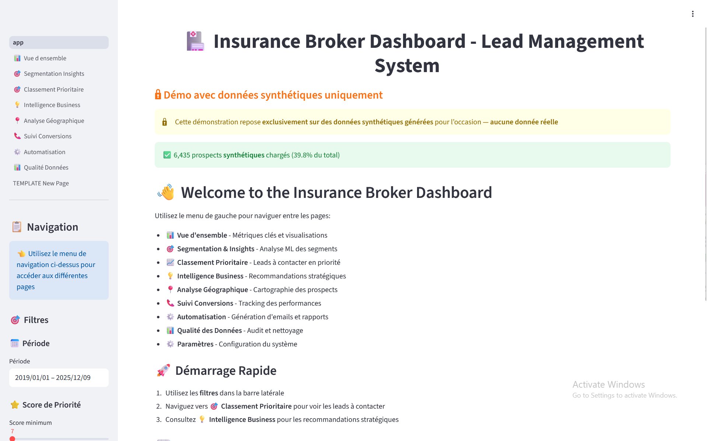

# Insurance Broker Dashboard
### Demo with Synthetic Data (No Real Data Required)

[](https://insurance-broker-dashboard.onrender.com)

🌐 Live Demo : [https://insurance-broker-dashboard.onrender.com](https://insurance-broker-dashboard.onrender.com)  
*Note: The dashboard is hosted on Render's free tier. If the site takes time to load, it may be waking up due to inactivity.*

---
## 📸 Example Screenshots

*Below are a few example screenshots. The app contains additional pages and features not shown here.*

### Dashboard Home


### Lead Prioritization Page


### Geographical analysis


### Conversion Tracking


# Insurance Broker Dashboard

🏥 **Modern Lead Management Dashboard with Advanced ML**

> **Portfolio Project** - Inspired by real-world experience during an internship at an insurance brokerage. During development, I worked with actual client data to build and test features, but all sensitive prospect information has been excluded from this repository for privacy and GDPR compliance.

Professional lead management and analysis system for health insurance brokers with:
- **K-Means Clustering** (5 automatic segments)
- **Isolation Forest** (anomaly detection)  
- **Real-time Conversion Tracking**
- **Automatic Email/Phone Validation**
- **Time Decay** for lead freshness
- **Modular Architecture** (8 pages)

## 🚀 Quick Start

### Demo with Synthetic Data (No Real Data Required)

⚠️ **Privacy Notice**: This repository does **NOT** contain real prospect data. All sensitive client information is excluded for privacy and GDPR compliance. The project includes a synthetic data generator for demonstration purposes.

```powershell
# 1. Automated installation (generates 16,000 fake prospects)
python setup.py

# 2. Launch dashboard
streamlit run app.py

# 3. Open: http://localhost:8502
```

The setup automatically generates realistic synthetic data matching the original schema, allowing you to explore all features without compromising real client privacy.


## 📁 Modular Structure

```
insurance_broker_dashboard/
│
├── app.py                         # Main entry point
├── pages/                         # Dashboard pages (auto-detected)
│   ├── 1_📊_Vue_d_ensemble.py
│   ├── 2_🎯_Segmentation_Insights.py
│   ├── 3_🎯_Classement_Prioritaire.py
│   ├── 4_💡_Intelligence_Business.py
│   ├── 5_📍_Analyse_Géographique.py
│   ├── 6_📞_Suivi_Conversions.py
│   ├── 7_⚙️_Automatisation.py
│   └── 8_📊_Qualité_Données.py
│
├── components/                    # Reusable components
│   ├── filters.py                 # Sidebar filters
│   └── metrics.py                 # Metric cards
│
├── utils/                         # Utilities
│   ├── data_loader.py             # Data loading (cached)
│   └── styling.py                 # Custom CSS
│
├── src/                           # Business logic
│   ├── ml_models.py               # K-Means + Isolation Forest
│   ├── data_processor.py          # Pipeline + scoring
│   ├── conversion_tracker.py      # Conversion tracking
│   └── business_intelligence.py   # AI recommendations
│
├── models/                        # Saved ML models
│   ├── segmentation_model.pkl     # K-Means (5 clusters)
│   ├── anomaly_detector.pkl       # Isolation Forest
│   └── feature_analyzer.pkl       # Feature importance
│
└── data/                          # Data files
    ├── prospects.csv              # Raw data
    ├── processed_prospects.csv    # Data with ML
    └── conversions.csv            # Conversion tracking
```

## ✨ Features

### 🤖 Advanced Machine Learning

**K-Means Clustering (5 segments)**
- Active - Families (13.7%)
- Young - Singles (27.1%)  
- Seniors - Couples (18.4%)
- Etc.

**Isolation Forest**
- Anomaly detection (5% contamination)
- 808 atypical prospects identified
- Hidden opportunities

**Feature Importance**
- Correlation analysis
- Top 10 features for conversions

### 📊 Intelligent Scoring

**Priority Score (0-23+)**
- Coverage (4-12 pts, capped)
- Children (non-linear: 1→+1, 2-3→+2, 4+→+3)
- Age (bucketed: <36→0, 36-50→0.5, 51-65→1, 65+→1.5)
- Email quality (0-1 pt): corporate/professional/personal/disposable
- Phone quality (0-1 pt): French format validation
- Time decay: automatic reduction for old leads
- Spouse, insurance plan, source, urgency

### 📞 Conversion Tracking

**Complete Module**
- Contact logging
- Real-time statistics
- Conversion rate by score
- Rate by ML segment
- CSV log export

### 🎯 8 Specialized Pages

1. **Overview**: KPIs, trends, distribution
2. **Segmentation Insights**: ML analysis, feature importance
3. **Priority Ranking**: Top leads sorted by adjusted_score
4. **Business Intelligence**: AI recommendations, trends
5. **Geographic Analysis**: Departments, cities, urban/rural
6. **Conversion Tracking**: Tracking, statistics, ROI
7. **Automation**: Exports, alerts, reports
8. **Data Quality**: Audit, profiling, issues

## 🔧 Configuration

### Requirements.txt
```txt
pandas>=2.3.0
numpy>=2.0.0
scikit-learn>=1.7.0
streamlit>=1.40.0
plotly>=5.24.0
joblib>=1.4.0
```

### Setup.py  
Met à jour pour utiliser `app.py` au lieu de `dashboard.py`

## 💡 Usage

### Daily Workflow (With Your Own Data)
```
1. Add your data: data/prospects.csv
2. Run: python setup.py (processes your data)
3. Open: streamlit run app.py
4. Go to "Priority Ranking" page
5. Filter by adjusted_score (time-decayed)
6. Contact Top 10 fresh leads
7. Log contacts in "Conversion Tracking"
```

### Demo Mode (Synthetic Data)
```powershell
# Generates and runs with fake data automatically
python setup.py
```

### Manual Data Generation
```powershell
# Generate 16,000 synthetic prospects
python src/generate_synthetic_data.py

# Train ML models on generated data
python src/ml_models.py

# Launch dashboard
streamlit run app.py
```

### ML Retraining
```powershell
python src/ml_models.py
```

### Adding New Pages
```python
# Copy pages/TEMPLATE_New_Page.py
# Rename to: pages/9_🔥_My_New_Page.py
# Streamlit auto-detects it!
```

## 📈 Metrics

- **16,159 prospects** processed
- **5 segments** automatic ML
- **808 anomalies** detected
- **Session state** persistent
- **Load time**: <2s

## 🔒 Privacy & Data Protection

⚠️ **Real client data is NOT included in this repository**  

This project was inspired by real-world insurance brokerage experience. During development, I worked with actual client data, but all sensitive prospect information has been excluded from this repository to maintain confidentiality and GDPR compliance. 

**What's included:**
- ✅ Synthetic data generator (`src/generate_synthetic_data.py`)
- ✅ 16,000 realistic fake prospects for demonstration
- ✅ All code, ML models, and dashboard functionality

**What's excluded:**
- ❌ Real client names, contact information, or personal data
- ❌ Actual prospect databases (protected by `.gitignore`)
- ❌ Any sensitive business information

The synthetic data generator creates realistic French insurance prospects with proper distributions, allowing full exploration of the dashboard's capabilities while maintaining client confidentiality.

**For production use**: Add your own `data/prospects.csv` file (format in data schema), and the system will process it automatically.

## 📚 Documentation

- `REFACTORING_GUIDE.md`: Architecture modulaire
- `pages/TEMPLATE_New_Page.py`: Template pour nouvelles pages
- Code commenté et docstrings

## 🆘 Support

**Dashboard won't start?**
```powershell
streamlit run app.py --server.port 8503
```

**Model errors?**
```powershell
python src/ml_models.py
```

**Empty session state?**
Pages automatically reload data if missing.

---

*Version 2.0 - Modular Architecture with Advanced ML*  
💼 **Portfolio Project** - Inspired by real insurance brokerage experience
